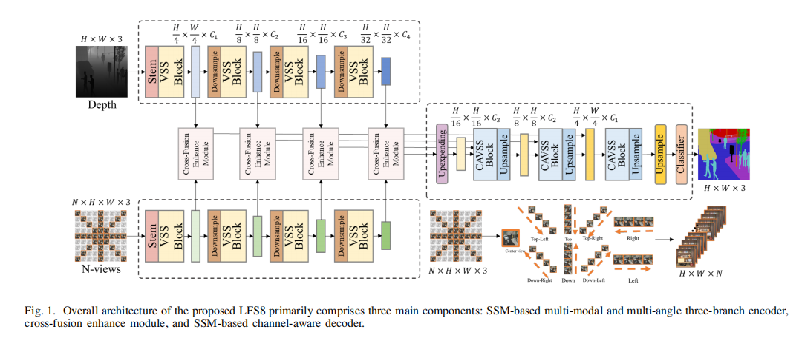
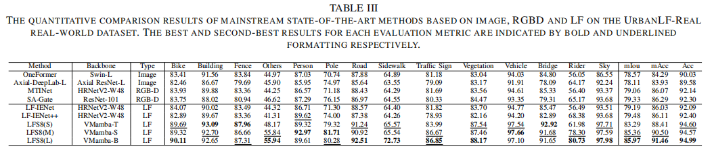
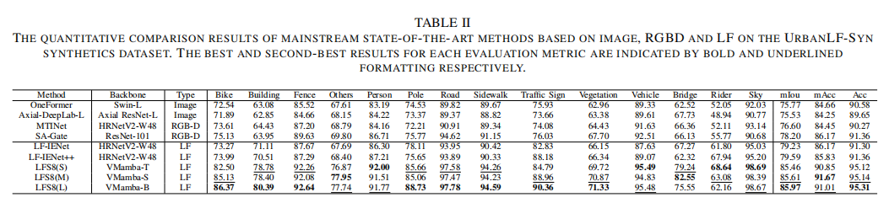

<h1> LFS8: A Lightweight and Robust Light Field Semantic Segmentation Network Based on Selective Scanning Structural State Sequence Space </h1>

## 👀Introduction
Efficient modeling of 4D light fields for precise semantic segmentation has recently faced challenges in capturing long-range dependency information (CNN-based) and the secondary computational complexity memory constraints (Transformer-based), which limit the utilization of multi-angular spatial information and the overall performance development. In this paper, we introduce LFS8, a novel light field semantic segmentation network based on the Selective Scanning Structural State Space Sequence Model (Mamba). LFS8 consists of an SSM-based encoder and a channel-aware decoder, designed to model and explore the rich spatial contextual information, complementary angular information, and structural information of light fields. To enhance LFS8's ability to handle complex lighting noise and tiny targets in real-world scenarios, we also introduce a scene depth information branch and design an SSM-based cross-fusion enhancement module to fuse and enhance the representation of multimodal multi-view light field information. This approach achieves high accuracy and robustness in semantic segmentation, accompanied by lower memory and computational complexity. Comprehensive experimental results on synthetic datasets and real-world datasets demonstrate the absolute superiority and effectiveness of the proposed LFS8, providing insightful strategies for efficiently utilizing and modeling large amounts of spatial angular information in light fields.



## 👀Results




## 💡Environment

We test our codebase with `PyTorch 1.13.1 + CUDA 11.7`. Please install corresponding PyTorch and CUDA versions according to your computational resources. 

1. Create environment.
    ```shell
    conda create -n LFS8 python=3.9
    conda activate LFS8
    ```

2. Install all dependencies.
Install pytorch, cuda and cudnn, then install other dependencies via:
    ```shell
    pip install torch==1.13.1+cu117 torchvision==0.14.1+cu117 torchaudio==0.13.1 --extra-index-url https://download.pytorch.org/whl/cu117
    ```
    ```shell
    pip install -r requirements.txt
    ```

3. Install Mamba
    ```shell
    cd models/encoders/selective_scan && pip install . && cd ../../..
    ```

## ⏳Setup

### Datasets

1. We use UrbanLF datasets, including both UrbanLF_Real and UrbanLF_Syn. Please refer to [UrbanLF](https://github.com/HAWKEYE-Group/UrbanLF) for dataset.

    Note: The central and peripheral views need to be extracted from the original data set and grayscale values processed on RGB labels

2. We also provide the processed datasets we use here: [UrbanLF_Real_processed](https://pan.baidu.com/s/1OKVlohVwRfTX3c4kM9hgXg?pwd=ifcq)

3. If you are using your own datasets, please orgnize the dataset folder in the following structure:
    ```shell
    <datasets>
    |-- <DatasetName1>
        |-- <DepthFolder>
            |-- <name1>.<ModalXFormat>
            |-- <name2>.<ModalXFormat>
            ...
        |-- <LFFolder>
            |-- <name1Folder>
               |-- <Image1>.<Image1Format>
               |-- <Image2>.<Image2Format>
               ...
               |-- <Image8>.<Image8Format>
            |-- <name2Folder>
        |-- <LabelFolder>
            |-- <name1>.<LabelFormat>
            |-- <name2>.<LabelFormat> 
            ...
        |-- train.txt
        |-- test.txt
    |-- <DatasetName2>
    |-- ...
    ```

    `train.txt/test.txt` contains the names of items in training/testing set, e.g.:

    ```shell
    <name1>
    <name2>
    ...
    ```

### Training

We will fully release the training process and code after acceptance.

### Evaluation

Currently, we only publicly release the optimal trained weights for UrbanLF_Real.

1.Please download the pretrained [VMamba](https://github.com/MzeroMiko/VMamba) weights:
      
- [VMamba_Tiny](https://github.com/MzeroMiko/VMamba/releases/download/%2320240218/vssmtiny_dp01_ckpt_epoch_292.pth)
- [VMamba_Small](https://github.com/MzeroMiko/VMamba/releases/download/%2320240218/vssmsmall_dp03_ckpt_epoch_238.pth)
- [VMamba_Base](https://github.com/MzeroMiko/VMamba/releases/download/%2320240218/vssmbase_dp06_ckpt_epoch_241.pth)

    <u> Please put them under `pretrained/vmamba/`. </u>

2.Run the evaluation by:
    
```shell
CUDA_VISIBLE_DEVICES="0/1/2/3/..." python eval.py -d="0" -n "dataset_name" -e="epoch_number" -p="visualize_savedir"
```

Here, `dataset_name=UbanLF_Real/UrbanLF_Syn`, referring to the datasets.\
`epoch_number` refers to a number standing for the epoch number you want to evaluate with.\
We provide the best `epoth.pth` of UrbanLF_Real in the [LFS8 Project]( https://pan.baidu.com/s/122sPEJ8XOWkJKC8QmoRM-w?pwd=3trq 提取码: 3trq) which is the whole project.\
You can replace `epoch_number` with `.log_final/log_UrbanLF_Real/epoth.pth`


3.Results will be saved in `visualize_savedir` and `visualize_savedir_color` folders.

## 📧Contact

If you have any questions, please contact at [qingweiwu@hnu.edu.cn](qingweiwu@hnu.edu.cn).
